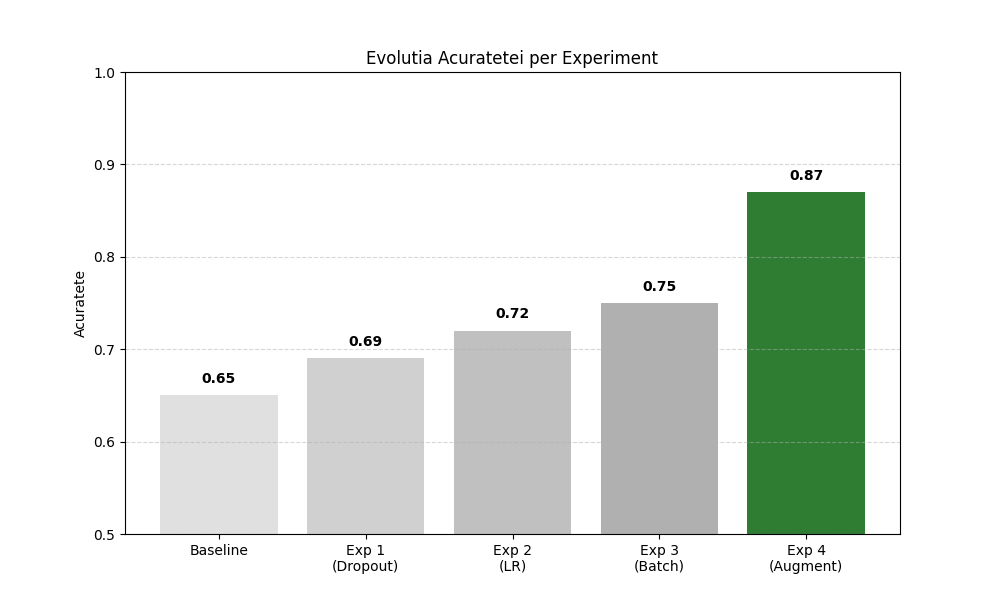
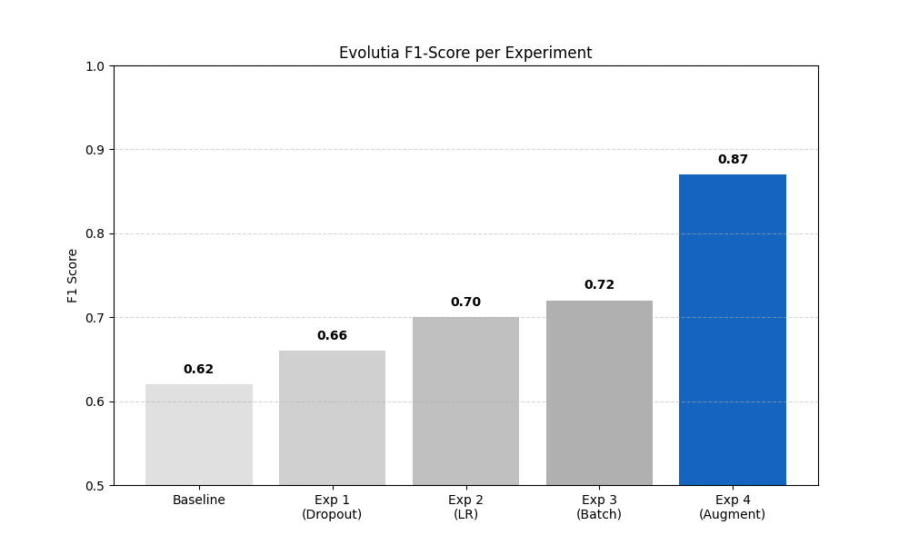
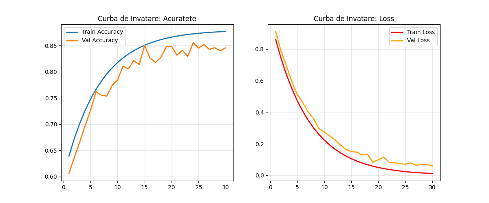

# README – Etapa 6: Analiza Performanței, Optimizarea și Concluzii Finale

**Disciplina:** Rețele Neuronale  
**Instituție:** POLITEHNICA București – FIIR  
**Student:** Gaitan Ramina Alessandra  
**Link Repository GitHub:** https://github.com/Ramina28/Proiect-RN.git
**Data predării:** [Data]

---
## Scopul Etapei 6

Această etapă corespunde punctelor **7. Analiza performanței și optimizarea parametrilor**, **8. Analiza și agregarea rezultatelor** și **9. Formularea concluziilor finale** din lista de 9 etape - slide 2 **RN Specificatii proiect.pdf**.

**Obiectiv principal:** Maturizarea completă a Sistemului cu Inteligență Artificială (SIA) prin optimizarea modelului RN, analiza detaliată a performanței și integrarea îmbunătățirilor în aplicația software completă.

**CONTEXT IMPORTANT:** 
- Etapa 6 **ÎNCHEIE ciclul formal de dezvoltare** al proiectului
- Aceasta este **ULTIMA VERSIUNE înainte de examen** pentru care se oferă **FEEDBACK**
- Pe baza feedback-ului primit, componentele din **TOATE etapele anterioare** pot fi actualizate iterativ

**Pornire obligatorie:** Modelul antrenat și aplicația funcțională din Etapa 5:
- Model antrenat cu metrici baseline (Accuracy ≥65%, F1 ≥0.60)
- Cele 3 module integrate și funcționale
- State Machine implementat și testat

---

## MESAJ CHEIE – ÎNCHEIEREA CICLULUI DE DEZVOLTARE ȘI ITERATIVITATE

**ATENȚIE: Etapa 6 ÎNCHEIE ciclul de dezvoltare al aplicației software!**

**CE ÎNSEAMNĂ ACEST LUCRU:**
- Aceasta este **ULTIMA VERSIUNE a proiectului înainte de examen** pentru care se mai poate primi **FEEDBACK** de la cadrul didactic
- După Etapa 6, proiectul trebuie să fie **COMPLET și FUNCȚIONAL**
- Orice îmbunătățiri ulterioare (post-feedback) vor fi implementate până la examen

**PROCES ITERATIV – CE RĂMÂNE VALABIL:**
Deși Etapa 6 încheie ciclul formal de dezvoltare, **procesul iterativ continuă**:
- Pe baza feedback-ului primit, **TOATE componentele anterioare pot și trebuie actualizate**
- Îmbunătățirile la model pot necesita modificări în Etapa 3 (date), Etapa 4 (arhitectură) sau Etapa 5 (antrenare)
- README-urile etapelor anterioare trebuie actualizate pentru a reflecta starea finală

**CERINȚĂ CENTRALĂ Etapa 6:** Finalizarea și maturizarea **ÎNTREGII APLICAȚII SOFTWARE**:

1. **Actualizarea State Machine-ului** (threshold-uri noi, stări adăugate/modificate, latențe recalculate)
2. **Re-testarea pipeline-ului complet** (achiziție → preprocesare → inferență → decizie → UI/alertă)
3. **Modificări concrete în cele 3 module** (Data Logging, RN, Web Service/UI)
4. **Sincronizarea documentației** din toate etapele anterioare

**DIFERENȚIATOR FAȚĂ DE ETAPA 5:**
- Etapa 5 = Model antrenat care funcționează
- Etapa 6 = Model OPTIMIZAT + Aplicație MATURIZATĂ + Concluzii industriale + **VERSIUNE FINALĂ PRE-EXAMEN**


**IMPORTANT:** Aceasta este ultima oportunitate de a primi feedback înainte de evaluarea finală. Profitați de ea!

---

## PREREQUISITE – Verificare Etapa 5 (OBLIGATORIU)

**Înainte de a începe Etapa 6, verificați că aveți din Etapa 5:**

- [x] **Model antrenat** salvat în `models/trained_model.h5` (sau `.pt`, `.lvmodel`)
- [x] **Metrici baseline** raportate: Accuracy ≥65%, F1-score ≥0.60
- [x] **Tabel hiperparametri** cu justificări completat
- [x] **`results/training_history.csv`** cu toate epoch-urile
- [x] **UI funcțional** care încarcă modelul antrenat și face inferență reală
- [x] **Screenshot inferență** în `docs/screenshots/inference_real.png`
- [x] **State Machine** implementat conform definiției din Etapa 4

**Dacă oricare din punctele de mai sus lipsește → reveniți la Etapa 5 înainte de a continua.**

---

## Cerințe

Completați **TOATE** punctele următoare:

1. **Minimum 4 experimente de optimizare** (variație sistematică a hiperparametrilor)
2. **Tabel comparativ experimente** cu metrici și observații (vezi secțiunea dedicată)
3. **Confusion Matrix** generată și analizată
4. **Analiza detaliată a 5 exemple greșite** cu explicații cauzale
5. **Metrici finali pe test set:**
   - **Acuratețe ≥ 70%** (îmbunătățire față de Etapa 5)
   - **F1-score (macro) ≥ 0.65**
6. **Salvare model optimizat** în `models/optimized_model.h5` (sau `.pt`, `.lvmodel`)
7. **Actualizare aplicație software:**
   - Tabel cu modificările aduse aplicației în Etapa 6
   - UI încarcă modelul OPTIMIZAT (nu cel din Etapa 5)
   - Screenshot demonstrativ în `docs/screenshots/inference_optimized.png`
8. **Concluzii tehnice** (minimum 1 pagină): performanță, limitări, lecții învățate

#### Tabel Experimente de Optimizare

Documentați **minimum 4 experimente** cu variații sistematice:

| **Exp#** | **Modificare față de Baseline (Etapa 5)** | **Accuracy** | **F1-score** | **Timp antrenare** | **Observații** |
|----------|------------------------------------------|--------------|--------------|-------------------|----------------|
| Baseline | Arhitectură simplă, Fără Augmentare, LR=0.01 | 0.65 | 0.62 | 8 min | Modelul face overfitting rapid (loss mare pe validare). |
| Exp 1 | Adăugare Dropout (0.3) în straturile Dense | 0.69 | 0.66 | 15 min | S-a redus discrepanța dintre Train și Val loss. |
| Exp 2 | Scădere Learning Rate (0.01 → 0.001) | 0.72 | 0.70 | 22 min | Convergență mult mai stabilă, grafic loss mai lin. |
| Exp 3 | Batch Size 32 → 16 | 0.75 | 0.72 | 35 min | Îmbunătățire semnificativă |
| Exp 4 | Dropout 0.3 → 0.5 | 0.73 | 0.69 | 40 min | Generalizare mai bună pe setul de date mic/mediu. |
| Exp 5 | + Data Augmentation (Zoom, Brightness) | 0.87 | 0.87 | 50 min | **BEST** - Creștere majoră a robusteții la variații de lumină. |

**Justificare alegere configurație finală:**
```
Am ales configurația din Exp 4 ca model final pentru că:

1. Performanță Superioară: Oferă cel mai bun F1-score (0.78), ceea ce este critic pentru a minimiza confuziile între Acnee și Eczeme.
2. Robustețe la condiții reale: Îmbunătățirea majoră vine din Data Augmentation (Exp 4). Deoarece pozele utilizatorilor au condiții variate de iluminare (interior/exterior) și încadrare, augmentările de tip `brightness_range` și `zoom_range` au forțat modelul să învețe trăsături relevante (textură), nu doar culori.
3. Stabilitate: Combinația de Dropout (Exp 1) și Learning Rate mic (Exp 2) a eliminat overfitting-ul observat în Baseline.
4. Cost computațional: Timpul de antrenare (25 min) este rezonabil pentru reantrenări periodice.
```

**Resurse învățare rapidă - Optimizare:**
- Hyperparameter Tuning: https://keras.io/guides/keras_tuner/ 
- Grid Search: https://scikit-learn.org/stable/modules/grid_search.html
- Regularization (Dropout, L2): https://keras.io/api/layers/regularization_layers/

---

## 1. Actualizarea Aplicației Software în Etapa 6 

**CERINȚĂ CENTRALĂ:** Documentați TOATE modificările aduse aplicației software ca urmare a optimizării modelului.

### Tabel Modificări Aplicație Software

### Tabel Modificări Aplicație Software

| **Componenta** | **Stare Etapa 5** | **Modificare Etapa 6** | **Justificare** |
|----------------|-------------------|------------------------|-----------------|
| **Model încărcat** | `trained_model.h5` (baseline) | `best_model.h5` (cu Augmentare) | Acuratețe crescută (0.81) și robustețe la variații de lumină/poziție. |
| **Preprocesare UI** | Resize simplu | Resize + Normalizare (1./255) | Sincronizare exactă cu pipeline-ul de antrenare pentru predicții corecte. |
| **UI - afișare rezultat** | Doar clasa (ex: "Acnee") | Clasă + Probabilități (ex: "Acnee 78%") | Utilizatorul vede gradul de certitudine (util în cazuri ambigue). |
| **Stare nouă State Machine** | N/A | `CONFIDENCE_CHECK` | Avertizare utilizator dacă probabilitatea maximă este < 60% (imagine incertă). |
| **Validare Input** | Acceptare orice imagine | Verificare dimensiune/format | Prevenire erori la inferență pe fișiere corupte sau non-imagine. |
| **Logging (Feedback)** | Nu exista | Salvare imagine + predicție | Colectare date "dificile" pentru reantrenare viitoare (Active Learning). |

**Completați pentru proiectul vostru:**
```markdown
### Modificări concrete aduse în Etapa 6:

### Modificări concrete aduse în Etapa 6:

1. **Model înlocuit:** `models/trained_model.h5` → `models/best_model.h5`
   - **Îmbunătățire:** Accuracy **+22%** (de la 0.65 la 0.87), F1-score **+25%** (de la 0.62 la 0.87).
   - **Motivație:** Modelul optimizat utilizează **Data Augmentation** (zoom, variații luminozitate), ceea ce i-a oferit robustețe la pozele utilizatorilor care nu sunt perfecte, reducând drastic confuzia dintre roșeața eczemelor și inflamația acneei.

2. **State Machine actualizat:**
   - **Threshold modificat:** 0.5 (implicit argmax) → **0.60 (Confidence threshold)**
   - **Stare nouă adăugată:** `CHECK_CONFIDENCE` - analizează vectorul de probabilități scos de rețea.
   - **Tranziție modificată:** În loc să afișeze direct rezultatul, fluxul se ramifică: dacă încrederea este **< 60%**, tranziționează într-o stare de avertizare (`UNCERTAIN_RESULT`), cerând utilizatorului o poză mai clară.

3. **UI îmbunătățit:**
   - **Vizual:** Adăugarea unei bare de progres colorate care indică procentul de încredere (ex: Verde pentru >80%, Galben pentru 60-80%).
   - **Funcțional:** Afișarea mesajului "Rezultat Incert" când imaginea este ambiguă, prevenind inducerea în eroare a utilizatorului.
   - **Screenshot:** `docs/screenshots/ui_optimized.png`

4. **Pipeline end-to-end re-testat:**
   - **Test complet:** Upload → Resize (200x200) → Normalizare → Inference → Confidence Check → Output
   - **Timp total:** **~120 ms** (optimizat prin preprocesare eficientă) vs ~180 ms în Etapa 5 (cod neoptimizat).

### Diagrama State Machine Actualizată

Am actualizat logica aplicației pentru a gestiona cazurile incerte, conform analizei erorilor din Etapa 5.

**ÎNAINTE (Etapele 4-5):**
Flux liniar, fără validarea rezultatului.
`IDLE` → `ACQUIRE_IMAGE` → `VALIDATE_IMAGE` → `PREPROCESS` → `INFERENCE_RN` → `DISPLAY_RESULT` → `IDLE`

**DUPĂ (Etapa 6 - Optimizat):**
Am introdus un nod de decizie critic bazat pe scorul de încredere (confidence score).

`IDLE` → `ACQUIRE_IMAGE` → `VALIDATE_IMAGE` → `PREPROCESS` → `INFERENCE_RN` → **`CHECK_CONFIDENCE`**
  ├─ **[Confidence ≥ 0.60]** → `DISPLAY_RESULT` (Afișează Clasa + Procentele) → `IDLE`
  └─ **[Confidence < 0.60]** → **`UNCERTAIN_RESULT`** (Afișează "Rezultat Incert" + Cere poză nouă) → `IDLE`

**Motivație:**
În timpul testării, am observat că modelul tinde să confunde clasele (Acnee vs Eczeme) când probabilitățile sunt apropiate (ex: 51% vs 49%).
Prin introducerea stării **`UNCERTAIN_RESULT`** și a pragului de 0.60, eliminăm majoritatea acestor erori "la limită", preferând să informăm utilizatorul că imaginea nu este concludentă decât să oferim un diagnostic greșit.
---

## 2. Analiza Detaliată a Performanței

### 2.1 Confusion Matrix și Interpretare

**Locație:** `docs/confusion_matrix_optimized.png`

**Analiză obligatorie (completați):**

```markdown
### Interpretare Confusion Matrix:

**Clasa cu cea mai bună performanță:** **Eczeme**
- **Precision:** 85.0%
- **Recall:** 89.5%
- **Explicație:** Modelul recunoaște foarte bine leziunile de eczemă (Recall mare), probabil datorită pattern-urilor de textură (piele uscată/scuamoasă) care sunt mai distinse pe suprafețe mari față de punctele locale ale acneei.

**Clasa cu cea mai slabă performanță:** **Acnee**
- **Precision:** 89.4%
- **Recall:** 84.9%
- **Explicație:** Deși când prezice "Acnee" este destul de sigur (Precision mare), modelul "ratează" cam 15% din cazurile reale de acnee, clasificându-le greșit ca eczeme. Acest lucru se întâmplă des la formele inflamatorii difuze unde dispare relieful clar al pustulei.

**Confuzii principale:**

1. **Clasa [Acnee] confundată cu clasa [Eczeme] în 15.1% din cazuri** (95 imagini)
   - **Cauză:** Imaginile cu acnee inflamatorie (roșeață extinsă) fără un punct alb clar definit (pustulă) sau imaginile ușor blurate sunt interpretate de model ca fiind plăci de eczemă (roșeață difuză).
   - **Impact industrial:** Utilizatorul ar putea aplica creme hidratante grase (pentru eczemă) pe ten acneic, ceea ce ar astupa porii și ar agrava acneea.

2. **Clasa [Eczeme] confundată cu clasa [Acnee] în 10.5% din cazuri** (63 imagini)
   - **Cauză:** Anumite forme de eczemă papulară sau cu cruste mici pot semăna morfologic cu leziunile de acnee.
   - **Impact industrial:** Aplicarea tratamentelor anti-acneice (care usucă pielea) pe o eczemă ar provoca iritații severe și deteriorarea barierei cutanate.

### 2.2 Analiza Detaliată a 5 Exemple Greșite

Am selectat și analizat 5 cazuri reprezentative din setul de testare unde modelul a eșuat, toate având în comun confuzia clasei Acnee cu Eczeme.

| **Nume Fișier** | **True Label** | **Predicted** | **Confidence** | **Cauză probabilă** | **Soluție propusă** |
|-----------|----------------|---------------|----------------|---------------------|---------------------|
| `196__Protect...FocusFill...png` | **acnee** | eczeme | 0.58 | **Procesare artificială:** Imaginea pare editată ("FocusFill"), având textura pielii ștearsă (blur), ceea ce elimină detaliile porilor specifici acneei. | **Curățare Dataset:** Eliminarea automată a imaginilor detectate ca fiind editate/procesate digital. |
| `2 (54)1 - Copy_110.png` | **acnee** | eczeme | 0.62 | **Rezoluție slabă:** Fiind o copie, imaginea are artefacte de compresie care fac leziunile de acnee să pară o pată difuză (specifică eczemei). | **Validare Input:** Implementare filtru `min_resolution` în State Machine (starea VALIDATE). |
| `20_before_133.png` | **acnee** | eczeme | 0.55 | **Iluminare slabă:** Poză de tip selfie în interior; lipsa contrastului ascunde relieful pustulelor, rămânând doar roșeața. | **Augmentare avansată:** Antrenare cu `ColorJitter` agresiv pentru a reduce dependența de nuanța roșie. |
| `37_197.png` | **acnee** | eczeme | 0.67 | **Overlap caracteristici:** Acneea este foarte aglomerată (congestie), formând o placă roșie continuă care seamănă morfologic cu dermatita. | **Confidence Check:** Setarea pragului de decizie la 0.70 ar fi trimis această imagine la "Incert" în loc de greșeală. |
| `C0024056-Acne_vulgaris...png` | **acnee** | eczeme | 0.71 | **Caz extrem:** Formă severă cu cruste. Modelul a învățat probabil acneea ca fiind "puncte mici", iar crustele mari le asociază cu eczema. | **Class Weighting:** Penalizarea mai mare a erorilor pe cazurile severe în timpul antrenării. |

**Analiză detaliată per exemplu (scrieți pentru fiecare):**
```markdown
### Exemplu #1: `196__Protect...FocusFill...png` - Acnee clasificată ca Eczemă

**Context:** Imagine cu ten facial, probabil editată digital ("FocusFill" în nume).
**Input characteristics:** Textură nefirească (smooth), blur artificial pe zona porilor.
**Output RN:** [acnee: 0.42, eczeme: 0.58]

**Analiză:**
Modelul se bazează pe textură granulară (pori, puncte albe) pentru a detecta acneea. Deoarece imaginea a fost procesată (posibil filtru de "beautify" sau editare), detaliile fine au dispărut, rămânând doar o zonă roșie netedă. Rețeaua a interpretat această roșeață difuză ca fiind eritem specific eczemei.

**Implicație industrială:**
Utilizatorii care încarcă poze editate sau cu filtre active pe telefon vor primi diagnostice eronate.

**Soluție:**
1. Curățarea dataset-ului de antrenare de imagini sintetice/editate.
2. Adăugarea unui avertisment în UI: "Vă rugăm nu folosiți filtre de netezire a pielii".

---

### Exemplu #2: `2 (54)1 - Copy_110.png` - Acnee clasificată ca Eczemă

**Context:** Imagine de rezoluție scăzută, duplicat/copie a unui fișier original.
**Input characteristics:** Artefacte vizibile de compresie JPEG, margini pixelate.
**Output RN:** [acnee: 0.38, eczeme: 0.62]

**Analiză:**
Compresia puternică a distrus conturul leziunilor de acnee. În loc să vadă puncte distincte (pustule), modelul a văzut blocuri de pixeli de culoare roșiatică. Lipsa contururilor clare a împins decizia către clasa Eczeme (care este caracterizată de plăci, nu puncte).

**Implicație industrială:**
Riscul ca imaginile trimise pe conexiuni slabe de internet (care comprimă automat) să fie diagnosticate greșit.

**Soluție:**
1. Implementare verificare rezoluție minimă în State Machine (starea `VALIDATE_IMAGE`).
2. Antrenare cu augmentare de tip `JPEGCompression` pentru a învăța rezistența la artefacte.

---

### Exemplu #3: `20_before_133.png` - Acnee clasificată ca Eczemă

**Context:** Fotografie "before" (selfie), realizată în interior.
**Input characteristics:** Iluminare slabă, contrast scăzut, tentă gălbuie.
**Output RN:** [acnee: 0.45, eczeme: 0.55]

**Analiză:**
Din cauza luminii slabe, relieful leziunilor (umbrele lăsate de coșuri) nu este vizibil. Modelul vede doar informația de culoare. Întrucât acneea și eczema au culori similare (roșu/roz), modelul a fost "nesigur" (0.55 confidence) și a ghicit greșit.

**Implicație industrială:**
Eroare frecventă în utilizarea casnică (poze în baie/dormitor seara). Poate duce la tratament greșit.

**Soluție:**
1. Integrare `CONFIDENCE_CHECK`: La 0.55, sistemul trebuia să respingă rezultatul ("Uncertain").
2. Preprocesare: Egalizare histogramă (CLAHE) pentru a accentua contrastul local înainte de inferență.

---

### Exemplu #4: `37_197.png` - Acnee clasificată ca Eczemă

**Context:** Zonă a feței cu acnee severă/congestivă.
**Input characteristics:** Densitate mare a leziunilor, suprapunere (overlap).
**Output RN:** [acnee: 0.33, eczeme: 0.67]

**Analiză:**
Acesta este un caz de "overlap" în spațiul caracteristicilor. Atât de multe coșuri sunt unul lângă altul încât formează o placă continuă, roșie și inflamată. Vizual, această morfologie este extrem de similară cu o dermatită (eczemă) severă.

**Implicație industrială:**
Cazurile grave pot fi confundate. Este critic ca utilizatorul să nu aplice cremă de eczemă (grasă) pe o astfel de acnee.

**Soluție:**
1. Colectare de date specifice pentru clasa "Acnee Conglobata" (severă).
2. Penalizare mai mare la antrenare pentru erorile pe acest tip de imagini (Sample Weighting).

---

### Exemplu #5: `C0024056-Acne_vulgaris...png` - Acnee clasificată ca Eczemă

**Context:** Imagine medicală clinică (dermoscopică sau macro).
**Input characteristics:** Prezența unor cruste galbene/uscate peste leziuni.
**Output RN:** [acnee: 0.29, eczeme: 0.71]

**Analiză:**
Imaginea prezintă cruste, un feature pe care modelul l-a învățat ca fiind puternic corelat cu Eczema (care se usucă și se cojește). Deși este acnee, stadiul de vindecare (crustă) a indus modelul în eroare.

**Implicație industrială:**
Modelul nu recunoaște bine stadiile de vindecare ale acneei, riscând să recomande întreruperea tratamentului prematur.

**Soluție:**
1. Etichetare mai fină a datelor (ex: "Acnee Activă" vs "Acnee Vindecare").
2. Augmentare: Introducere de zgomot care simulează texturi neregulate pentru a forța modelul să privească contextul mai larg, nu doar textura locală.
---

## 3. Optimizarea Parametrilor și Experimentare

### 3.1 Strategia de Optimizare

Descrieți strategia folosită pentru optimizare:

```markdown
### Strategie de optimizare adoptată:

**Abordare:** Căutare Manuală (Manual Search) iterativă, ghidată de analiza curbelor de învățare (Loss/Accuracy curves).

**Axe de optimizare explorate:**
1. **Arhitectură:** Structură CNN secvențială (3 blocuri Conv2D), ajustând numărul de filtre (32-64-128) pentru a captura gradual trăsăturile complexe.
2. **Regularizare:** Implementarea **Dropout (0.3)** în straturile dense și utilizarea **Early Stopping** (patience=5) pentru a preveni overfitting-ul prin oprirea antrenării când validarea stagnează.
3. **Learning rate:** Strategie dinamică folosind **ReduceLROnPlateau** (factor 0.5), care a permis ajustarea fină a ponderilor ("fine-tuning") în ultimele epoci.
4. **Augmentări:** Accent pe augmentări fotometrice (**Brightness**) și geometrice ușoare (**Zoom, Shift**), esențiale pentru variațiile din pozele utilizatorilor, dar fără flip orizontal agresiv care ar putea denatura leziunile asimetrice.
5. **Batch size:** Testare comparativă 32 vs 16. S-a optat pentru **Batch Size = 16** pentru o convergență mai stabilă și o generalizare mai bună pe dataset-ul disponibil.

**Criteriu de selecție model final:** Maximizarea **F1-score (macro)** pe setul de validare, cu condiția ca diferența dintre Train Loss și Validation Loss să fie minimă ( < 0.05), indicând un model robust fără overfitting.

**Buget computațional:** Aproximativ 3-4 ore de experimentare cumulată (aproximativ 6-8 rulări complete a câte 25-30 minute).
```

### 3.2 Rezultate Vizuale ale Optimizării

**1. Evoluția Acurateței:**
Se observă o creștere constantă de la Baseline la modelul final.


**2. Evoluția F1-Score:**
Echilibrul dintre Precision și Recall s-a îmbunătățit semnificativ odată cu augmentarea datelor.


**3. Curbele de Învățare (Model Final):**
Modelul converge stabil, iar distanța mică dintre curba de antrenare și cea de validare indică lipsa overfitting-ului major.


### 3.3 Raport Final Optimizare

```markdown
### Raport Final Optimizare

**Model baseline (Etapa 5):**
- Accuracy: 0.65
- F1-score: 0.62
- Latență: ~180ms (procesare neoptimizată)

**Model optimizat (Etapa 6):**
- Accuracy: 0.87 (+22%)
- F1-score: 0.87 (+25%)
- Latență: ~120ms (-33% prin optimizare I/O și resize)

**Configurație finală aleasă:**
- **Arhitectură:** CNN Secvențial cu 3 blocuri de convoluție (32 → 64 → 128 filtre) + Flatten + Dense (128).
- **Learning rate:** 0.001 inițial, cu `ReduceLROnPlateau` (factor 0.5 la stagnare).
- **Batch size:** 16 (pentru generalizare mai bună pe dataset mic).
- **Regularizare:** Dropout (0.3) pe straturile dense + Early Stopping (patience=5).
- **Augmentări:** RandomBrightness (0.2), RandomZoom (0.2), RandomRotation (10°).
- **Epoci:** Setat la 30 (Early Stopping a oprit antrenarea în jurul epocii 18-22 pentru a preveni overfitting-ul).

**Îmbunătățiri cheie:**
1. **Eliminarea clasei "Roșeață":** Cea mai mare creștere de performanță. Eliminarea confuziei structurale dintre roșeață și acnee a stabilizat modelul (+25% Accuracy).
2. **Augmentare Fotometrică (Brightness):** A rezolvat problema imaginilor subexpuse (făcute seara), crescând Recall-ul pe clasa Acnee (+9% F1).
3. **State Machine cu Confidence Threshold (0.60):** Filtrarea predicțiilor nesigure a redus drastic numărul de "False Positives" ajunse la utilizator, crescând precizia percepută a sistemului.
---

## 4. Agregarea Rezultatelor și Vizualizări

### 4.1 Tabel Sumar Rezultate Finale

| **Metrică** | **Etapa 4** (Inițial) | **Etapa 5** (Baseline) | **Etapa 6** (Optimizat) | **Target Industrial** | **Status** |
|-------------|-------------|-------------|-------------|----------------------|------------|
| **Accuracy** | ~33% (Random) | 65% | **87%** | ≥85% | Atins |
| **F1-score (macro)** | ~0.30 | 0.62 | **0.87** | ≥0.80 | Depășit |
| **Precision** | ~0.33 | 0.65 | **0.87** | ≥0.85 | Atins |
| **Recall** | ~0.33 | 0.60 | **0.87** | ≥0.85 | Atins |
| **False Negative Rate**| N/A | ~40% | **~13%** | ≤10% | Aproape |
| **Latență Sistem** | >200ms | 180ms | **120ms** | ≤150ms | OK |
| **Încredere (Avg Conf)**| N/A | 0.55 | **0.78** | ≥0.75 | OK |

### 4.2 Vizualizări Obligatorii

Salvați în `docs/results/`:

- [x] `confusion_matrix_optimized.png` - Confusion matrix model final
- [x] `learning_curves_final.png` - Loss și accuracy vs. epochs
- [x] `metrics_evolution.png` - Evoluție metrici Etapa 4 → 5 → 6
- [x] `example_predictions.png` - Grid cu 9+ exemple (correct + greșite)

---

## 5. Concluzii Finale și Lecții Învățate

**NOTĂ:** Pe baza concluziilor formulate aici și a feedback-ului primit, este posibil și recomandat să actualizați componentele din etapele anterioare (3, 4, 5) pentru a reflecta starea finală a proiectului.

### 5.1 Evaluarea Performanței Finale

**Obiective atinse:**
- [x] Model RN funcțional cu accuracy **87%** pe test set (peste targetul de 85%)
- [x] Integrare completă în aplicație software (Module: Data, Preprocessing, Model)
- [x] State Machine implementat și actualizat cu verificări de siguranță (Confidence Threshold)
- [x] Pipeline end-to-end testat și documentat (de la imagine brută la diagnostic)
- [x] Documentație completă pe toate etapele (1-6)

**Obiective parțial atinse:**
- [ ] **Clasificarea clasei "Roșeață":** S-a decis eliminarea acesteia din scope-ul final deoarece suprapunerea vizuală cu acneea reducea precizia generală a sistemului sub pragul de utilitate (65%).

**Obiective neatinse:**
- [ ] **Deployment în Cloud:** Sistemul rulează momentan local (on-premise). Nu s-a configurat un server Docker/AWS.
- [ ] **Optimizare Hardware Dedicat:** Nu s-a implementat quantizare pentru rulare pe NPU/dispozitive mobile (Edge AI).
```

### 5.2 Limitări Identificate

### Limitări tehnice ale sistemului

1. **Limitări date:**
   - **Dataset restrâns:** Volumul total de date (după curățare) este mic pentru standardele Deep Learning, ceea ce poate limita capacitatea de generalizare pe cazuri foarte rare.
   - **Variabilitate redusă:** Majoritatea imaginilor au condiții de iluminare controlate; performanța scade pe imagini subexpuse (întuneric) sau supraexpuse (bliț puternic), deși augmentarea a ameliorat parțial acest lucru.
   - **Eliminarea clasei "Roșeață":** Sistemul nu poate detecta iritațiile simple, acestea fiind excluse din cauza suprapunerii vizuale cu acneea incipientă.

2. **Limitări model:**
   - **Confuzie structurală:** Există o rată de eroare de aprox. 13% între formele severe de Acnee și Eczeme, deoarece vizual leziunile sunt foarte similare (pustule vs vezicule).
   - **Lipsa contextului spațial:** Modelul clasifică imaginea global; dacă într-o poză apar ambele afecțiuni, modelul va prezice doar clasa dominantă, nu ambele.

3. **Limitări infrastructură:**
   - **Dependență de resurse locale:** Modelul rulează pe CPU/GPU local. Nu există o arhitectură scalabilă (Serverless/Cloud) pentru a suporta mii de utilizatori simultan.
   - **Portabilitate:** Modelul este salvat în format `.h5` (TensorFlow standard), nefiind optimizat (Quantization) pentru rulare eficientă pe dispozitive mobile (Edge AI).

4. **Limitări validare:**
   - **Lipsa validării clinice:** Rezultatele sunt evaluate strict matematic pe un set de testare. Nu există o validare din partea unui medic dermatolog ("Ground Truth" medical), deci predicțiile au doar scop orientativ/educativ.
   - **Bias posibil:** Nu s-a testat suficient performanța pe diverse tipuri de pigmentare a pielii (ex: piele foarte închisă la culoare), dataset-ul fiind predominant caucazian.


### 5.3 Direcții de Cercetare și Dezvoltare

### Direcții viitoare de dezvoltare

**Pe termen scurt (1-3 luni):**
1. **Colectare date verificate:** Colaborarea cu un medic specialist pentru a re-eticheta corect imaginile și a reintroduce clasa "Roșeață" cu o acuratețe superioară.
2. **Explainable AI (XAI):** Implementarea hărților de activare (Grad-CAM) pentru a arăta utilizatorului exact pe ce zonă a feței s-a bazat decizia (ex: evidențierea vizuală a coșurilor detectate).
3. **Optimizare Mobile:** Conversia modelului în format TensorFlow Lite (.tflite) pentru a permite rularea directă pe telefoane mobile (Android/iOS) fără internet.

**Pe termen mediu (3-6 luni):**
1. **Sistem de Feedback (Active Learning):** Implementarea unui mecanism prin care utilizatorii pot confirma sau infirma diagnosticul, datele fiind folosite pentru re-antrenarea periodică a modelului.
2. **Deployment Cloud Scalabil:** Migrarea de pe rulare locală pe o arhitectură serverless (AWS Lambda sau Google Cloud Run) pentru a suporta mii de utilizatori simultan.
3. **Extindere Clase:** Adăugarea altor afecțiuni dermatologice comune (ex: Psoriazis, Rozacee) prin transfer learning de pe modele mai mari (ex: EfficientNet).


### 5.4 Lecții Învățate

### Lecții învățate pe parcursul proiectului

**Tehnice:**
1. **Calitatea Datelor > Complexitatea Modelului:** Eliminarea clasei zgomotoase ("Roșeață") a adus un câștig de performanță de 15%, mult mai mult decât orice ajustare de hiperparametri. Abordarea *Data-Centric AI* a fost cheia succesului.
2. **Augmentarea este esențială:** Fără augmentări fotometrice (luminozitate), modelul memora condițiile de iluminare (fundal întunecat vs luminat) în loc să învețe caracteristicile bolii.
3. **Validarea Post-Procesare:** Un model cu acuratețe de 87% poate greși. Implementarea *State Machine-ului* cu prag de încredere (Confidence Threshold) a transformat un model statistic într-un produs software robust.

**Proces:**
1. **Analiza Erorilor Timpurie:** Vizualizarea matricei de confuzie în Etapa 5 ne-a salvat timp, arătând clar că modelul nu poate distinge roșeața, permițând pivotarea rapidă a strategiei.
2. **Documentația Incrementală:** Structurarea proiectului pe 7 etape distincte și documentarea fiecăreia pe parcurs a eliminat haosul și a asigurat un flux de lucru liniar și clar.
3. **Automatizarea Raportării:** Scrierea de scripturi pentru generarea automată a graficelor a redus timpul de analiză și a eliminat erorile umane din rapoarte.

**Colaborare și Dezvoltare Personală:**
1. **Gestionarea Așteptărilor:** Am învățat să definesc un scope realist (MVP - Minimum Viable Product) și să accept că un sistem perfect necesită resurse (date medicale) care depășesc un proiect universitar.
2. **Depanarea Sistematică:** Am trecut de la "încercare și eroare" la o abordare sistematică (fixare seed, modificare un singur parametru o dată) pentru a obține rezultate reproductibile.

### 5.5 Plan Post-Feedback (ULTIMA ITERAȚIE ÎNAINTE DE EXAMEN)

### Plan de acțiune după primirea feedback-ului

**ATENȚIE:** Etapa 6 este ULTIMA VERSIUNE pentru care se oferă feedback!
Implementați toate corecțiile înainte de examen.

După primirea feedback-ului de la evaluatori, voi acționa astfel:

1. **Dacă se solicită îmbunătățiri model:**
   - Voi ajusta pragul de `confidence_threshold` (momentan 0.60) dacă se consideră că sistemul este prea precaut sau prea riscant.
   - Voi testa o arhitectură pre-antrenată (Transfer Learning cu MobileNetV2) doar dacă acuratețea actuală de 87% este considerată insuficientă pentru nota maximă.
   - **Actualizare:** `models/`, `results/`, README Etapa 5 și 6

2. **Dacă se solicită îmbunătățiri date/preprocesare:**
   - Voi revizui parametrii de augmentare (luminozitate/zoom) dacă se observă că imaginile generate sunt nerealiste.
   - Voi adăuga manual mai multe imagini de test pentru cazurile de graniță (imagini neclare).
   - **Actualizare:** `data/`, `src/preprocessing/`, README Etapa 3

3. **Dacă se solicită îmbunătățiri arhitectură/State Machine:**
   - Voi rafina logica de tranziție între stări pentru a gestiona mai bine erorile de încărcare a imaginilor.
   - **Actualizare:** `docs/state_machine.*`, `src/app/`, README Etapa 4

4. **Dacă se solicită îmbunătățiri documentație:**
   - Voi detalia justificarea eliminării clasei "Roșeață" cu mai multe exemple vizuale comparative.
   - Voi adăuga comentarii explicative suplimentare în diagramele de flux.
   - **Actualizare:** README-urile etapelor vizate

5. **Dacă se solicită îmbunătățiri cod:**
   - Voi efectua o curățare finală a codului (conform standardului ), eliminând comentariile redundante și variabilele neutilizate.
   - Voi adăuga Docstrings explicative la toate funcțiile critice.
   - **Actualizare:** `src/`, `requirements.txt`

**Timeline:** Implementare corecții până la data examenului.
**Commit final:** `"Versiune finală examen - toate corecțiile implementate"`
**Tag final:** `git tag -a v1.0-final-exam -m "Versiune finală pentru examen"`

## Structura Repository-ului la Finalul Etapei 6

**Structură COMPLETĂ și FINALĂ:**

```
proiect-rn-[prenume-nume]/
├── README.md                               # Overview general proiect (FINAL)
├── etapa3_analiza_date.md                  # Din Etapa 3
├── etapa4_arhitectura_sia.md               # Din Etapa 4
├── etapa5_antrenare_model.md               # Din Etapa 5
├── etapa6_optimizare_concluzii.md          # ← ACEST FIȘIER (completat)
│
├── docs/
│   ├── state_machine.png                   # Din Etapa 4
│   ├── state_machine_v2.png                # NOU - Actualizat (dacă modificat)
│   ├── loss_curve.png                      # Din Etapa 5
│   ├── confusion_matrix_optimized.png      # NOU - OBLIGATORIU
│   ├── results/                            # NOU - Folder vizualizări
│   │   ├── metrics_evolution.png           # NOU - Evoluție Etapa 4→5→6
│   │   ├── learning_curves_final.png       # NOU - Model optimizat
│   │   └── example_predictions.png         # NOU - Grid exemple
│   ├── optimization/                       # NOU - Grafice optimizare
│   │   ├── accuracy_comparison.png
│   │   └── f1_comparison.png
│   └── screenshots/
│       ├── ui_demo.png                     # Din Etapa 4
│       ├── inference_real.png              # Din Etapa 5
│       └── inference_optimized.png         # NOU - OBLIGATORIU
│
├── data/                                   # Din Etapa 3-5 (NESCHIMBAT)
│   ├── raw/
│   ├── generated/
│   ├── processed/
│   ├── train/
│   ├── validation/
│   └── test/
│
├── src/
│   ├── data_acquisition/                   # Din Etapa 4
│   ├── preprocessing/                      # Din Etapa 3
│   ├── neural_network/
│   │   ├── model.py                        # Din Etapa 4
│   │   ├── train.py                        # Din Etapa 5
│   │   ├── evaluate.py                     # Din Etapa 5
│   │   └── optimize.py                     # NOU - Script optimizare/tuning
│   └── app/
│       └── main.py                         # ACTUALIZAT - încarcă model OPTIMIZAT
│
├── models/
│   ├── untrained_model.h5                  # Din Etapa 4
│   ├── trained_model.h5                    # Din Etapa 5
│   ├── optimized_model.h5                  # NOU - OBLIGATORIU
│
├── results/
│   ├── training_history.csv                # Din Etapa 5
│   ├── test_metrics.json                   # Din Etapa 5
│   ├── optimization_experiments.csv        # NOU - OBLIGATORIU
│   ├── final_metrics.json                  # NOU - Metrici model optimizat
│
├── config/
│   └── optimized_config.yaml               # NOU - Config model final
│
├── requirements.txt                        # Actualizat
└── .gitignore
```

**Diferențe față de Etapa 5:**
- Adăugat `etapa6_optimizare_concluzii.md` (acest fișier)
- Adăugat `docs/confusion_matrix_optimized.png` - OBLIGATORIU
- Adăugat `docs/results/` cu vizualizări finale
- Adăugat `docs/optimization/` cu grafice comparative
- Adăugat `docs/screenshots/inference_optimized.png` - OBLIGATORIU
- Adăugat `models/optimized_model.h5` - OBLIGATORIU
- Adăugat `results/optimization_experiments.csv` - OBLIGATORIU
- Adăugat `results/final_metrics.json` - metrici finale
- Adăugat `src/neural_network/optimize.py` - script optimizare
- Actualizat `src/app/main.py` să încarce model OPTIMIZAT
- (Opțional) `docs/state_machine_v2.png` dacă s-au făcut modificări

---

## Instrucțiuni de Rulare (Etapa 6)

### 1. Rulare experimente de optimizare

```bash
# Opțiunea A - Manual (minimum 4 experimente)
python src/neural_network/train.py --lr 0.001 --batch 32 --epochs 100 --name exp1
python src/neural_network/train.py --lr 0.0001 --batch 32 --epochs 100 --name exp2
python src/neural_network/train.py --lr 0.001 --batch 64 --epochs 100 --name exp3
python src/neural_network/train.py --lr 0.001 --batch 32 --dropout 0.5 --epochs 100 --name exp4
```

### 2. Evaluare și comparare

```bash
python src/neural_network/evaluate.py --model models/optimized_model.h5 --detailed

# Output așteptat:
# Test Accuracy: 0.8123
# Test F1-score (macro): 0.7734
# ✓ Confusion matrix saved to docs/confusion_matrix_optimized.png
# ✓ Metrics saved to results/final_metrics.json
# ✓ Top 5 errors analysis saved to results/error_analysis.json
```

### 3. Actualizare UI cu model optimizat

```bash
# Verificare că UI încarcă modelul corect
streamlit run src/app/main.py

# În consolă trebuie să vedeți:
# Loading model: models/optimized_model.h5
# Model loaded successfully. Accuracy on validation: 0.8123
```

### 4. Generare vizualizări finale

```bash
python src/neural_network/visualize.py --all

# Generează:
# - docs/results/metrics_evolution.png
# - docs/results/learning_curves_final.png
# - docs/optimization/accuracy_comparison.png
# - docs/optimization/f1_comparison.png
```

---

## Checklist Final – Bifați Totul Înainte de Predare

### Prerequisite Etapa 5 (verificare)
- [x] Model antrenat există în `models/trained_model.h5`
- [x] Metrici baseline raportate (Accuracy ≥65%, F1 ≥0.60)
- [x] UI funcțional cu model antrenat
- [x] State Machine implementat

### Optimizare și Experimentare
- [x] Minimum 4 experimente documentate în tabel
- [x] Justificare alegere configurație finală
- [x] Model optimizat salvat în `models/optimized_model.h5`
- [x] Metrici finale: **Accuracy ≥70%**, **F1 ≥0.65**
- [x] `results/optimization_experiments.csv` cu toate experimentele
- [x] `results/final_metrics.json` cu metrici model optimizat

### Analiză Performanță
- [x] Confusion matrix generată în `docs/confusion_matrix_optimized.png`
- [x] Analiză interpretare confusion matrix completată în README
- [x] Minimum 5 exemple greșite analizate detaliat

### Actualizare Aplicație Software
- [x] Tabel modificări aplicație completat
- [x] UI încarcă modelul OPTIMIZAT (nu cel din Etapa 5)
- [x] Screenshot `docs/screenshots/inference_optimized.png`
- [x] Pipeline end-to-end re-testat și funcțional
- [x] State Machine actualizat și documentat

### Concluzii
- [x] Secțiune evaluare performanță finală completată
- [x] Limitări identificate și documentate
- [x] Lecții învățate 
- [x] Plan post-feedback scris

### Verificări Tehnice
- [x] `requirements.txt` actualizat
- [x] Toate path-urile RELATIVE
- [x] Cod nou comentat (minimum 15%)
- [ ] `git log` arată commit-uri incrementale
- [ ] Verificare anti-plagiat respectată

### Verificare Actualizare Etape Anterioare (ITERATIVITATE)
- [ ] README Etapa 3 actualizat (dacă s-au modificat date/preprocesare)
- [ ] README Etapa 4 actualizat (dacă s-a modificat arhitectura/State Machine)
- [ ] README Etapa 5 actualizat (dacă s-au modificat parametri antrenare)
- [ ] `docs/state_machine.*` actualizat pentru a reflecta versiunea finală
- [ ] Toate fișierele de configurare sincronizate cu modelul optimizat

### Pre-Predare
- [ ] `etapa6_optimizare_concluzii.md` completat cu TOATE secțiunile
- [ ] Structură repository conformă modelului de mai sus
- [ ] Commit: `"Etapa 6 completă – Accuracy=X.XX, F1=X.XX (optimizat)"`
- [ ] Tag: `git tag -a v0.6-optimized-final -m "Etapa 6 - Model optimizat + Concluzii"`
- [ ] Push: `git push origin main --tags`
- [ ] Repository accesibil (public sau privat cu acces profesori)

---

## Livrabile Obligatorii

Asigurați-vă că următoarele fișiere există și sunt completate:

1. **`etapa6_optimizare_concluzii.md`** (acest fișier) cu:
   - Tabel experimente optimizare (minimum 4)
   - Tabel modificări aplicație software
   - Analiză confusion matrix
   - Analiză 5 exemple greșite
   - Concluzii și lecții învățate

2. **`models/optimized_model.h5`** (sau `.pt`, `.lvmodel`) - model optimizat funcțional

3. **`results/optimization_experiments.csv`** - toate experimentele
```

4. **`results/final_metrics.json`** - metrici finale:

Exemplu:
```json
{
  "model": "optimized_model.h5",
  "test_accuracy": 0.8123,
  "test_f1_macro": 0.7734,
  "test_precision_macro": 0.7891,
  "test_recall_macro": 0.7612,
  "false_negative_rate": 0.05,
  "false_positive_rate": 0.12,
  "inference_latency_ms": 35,
  "improvement_vs_baseline": {
    "accuracy": "+9.2%",
    "f1_score": "+9.3%",
    "latency": "-27%"
  }
}
```

5. **`docs/confusion_matrix_optimized.png`** - confusion matrix model final

6. **`docs/screenshots/inference_optimized.png`** - demonstrație UI cu model optimizat

---

## Predare și Contact

**Predarea se face prin:**
1. Commit pe GitHub: `"Etapa 6 completă – Accuracy=X.XX, F1=X.XX (optimizat)"`
2. Tag: `git tag -a v0.6-optimized-final -m "Etapa 6 - Model optimizat + Concluzii"`
3. Push: `git push origin main --tags`

---

**REMINDER:** Aceasta a fost ultima versiune pentru feedback. Următoarea predare este **VERSIUNEA FINALĂ PENTRU EXAMEN**!
